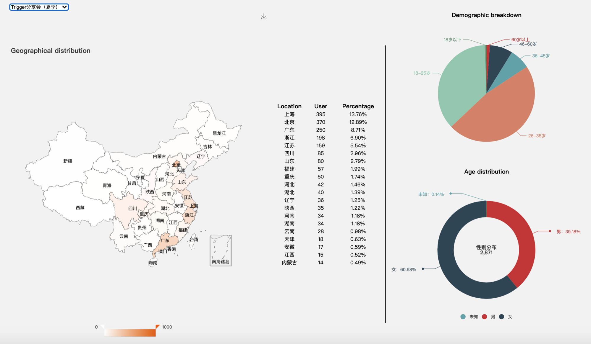
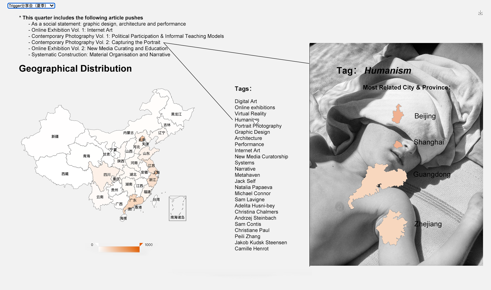
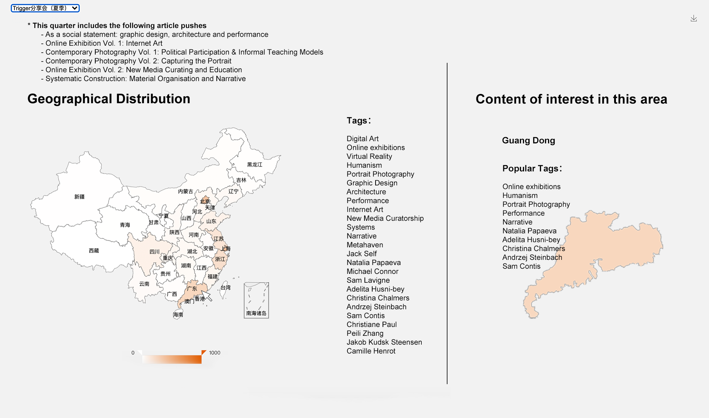
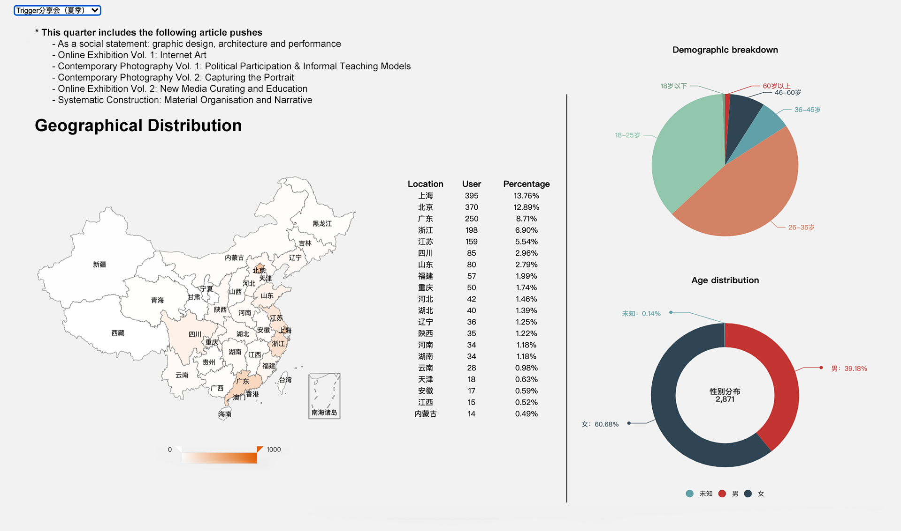

## Rethinking - the Visualisation Tool use for Content Analysis

While my original design was for the collation and visualisation of
intuitive data, for this version I thought about how to add meaningful
functionality to the existing framework.

Original page：

I thought that maybe this visualisation page could be a content analysis
tool to understand what topics are of more interest to a specific
audience in a specific region, so that I can target and promote content
more accurately.

### Solutions

#### ​1. Database Merging

I added some keywords (tags) to each article, so that the number of
readers of each article would be converted into data related to the
"attention" of these keywords.

#### ​2. Visualisation

I have thought of two scenarios.

-   First, find highly relevant areas based on the tag.

(To make it more visual readability, this version inserting a picture from the
article related to the tag)

-   Second, based on regions to correspond to tag keywords with a
    higher level of attention.

-   

### Other modifications

I added the list of articles of each quarter, so that it is easy
to understand which article the keyword comes from.

